<h1 align="center">TeethKids</h1>

<p align="center"><em>Dois aplicativos móveis sobre um mesmo backend Firebase: um para quem pede socorro odontológico e outro para o dentista que atende.</em></p>

<p align="center">
  
  
  
  
  
</p>

<p align="center"><b>Português</b> · <a href="README.en.md">English</a></p>

---

## 📸 Preview

As capturas abaixo foram obtidas com a camada de dados substituída por valores de demonstração — o projeto Firebase original não está mais no ar. As telas do **Dentista** vêm de um emulador Android 33; as do **Socorrista**, do simulador do iPhone 15 (iOS).

### Dentista

| Login | Perfil | Lista de emergências |
| :---: | :---: | :---: |
| 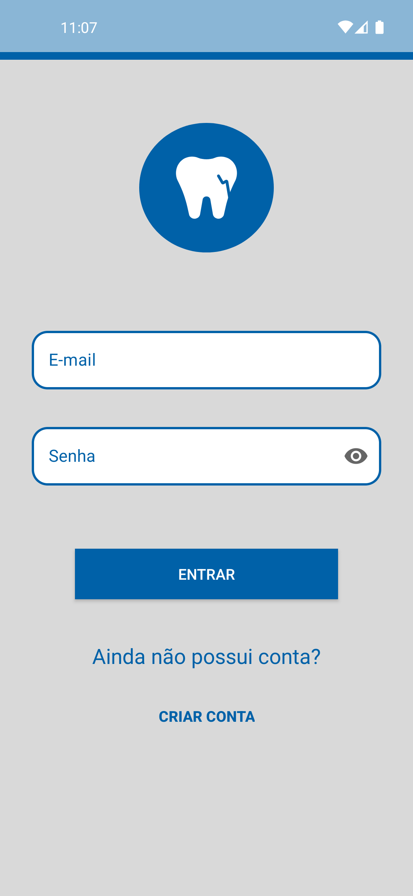 | 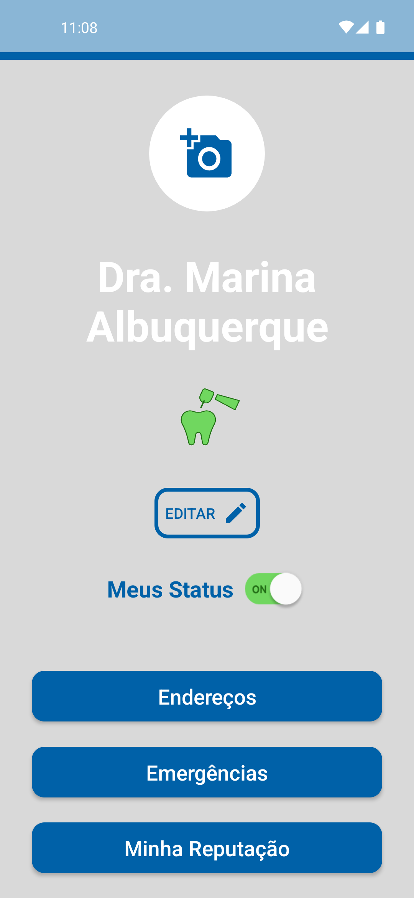 | 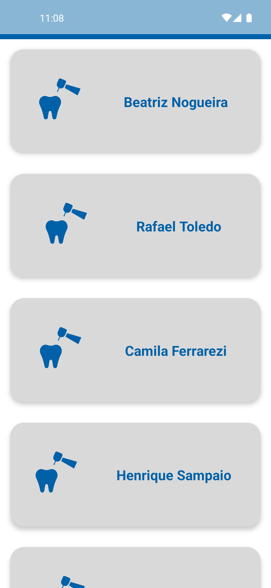 |

| Detalhe da emergência | Emergência em andamento | Reputação |
| :---: | :---: | :---: |
| 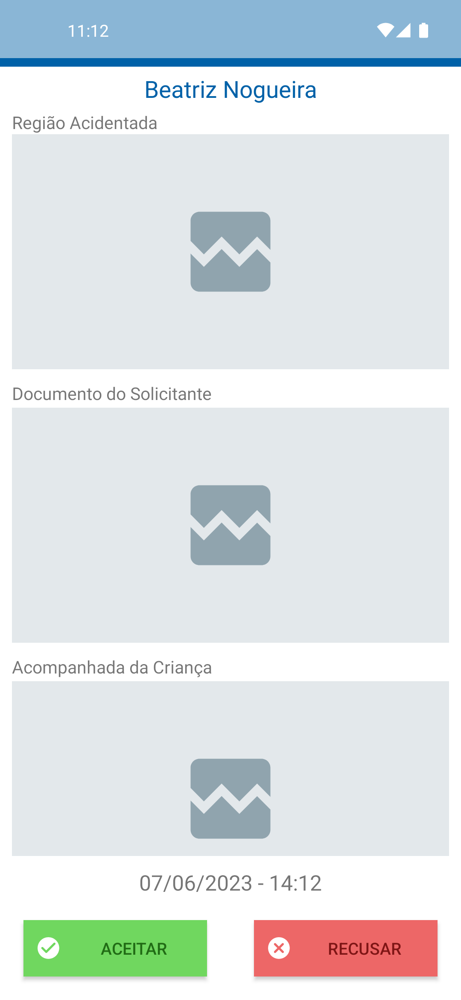 | 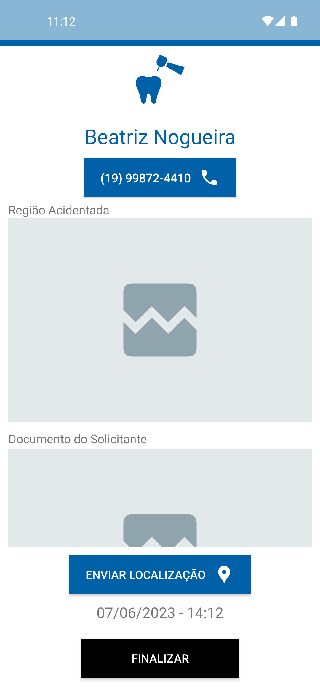 | 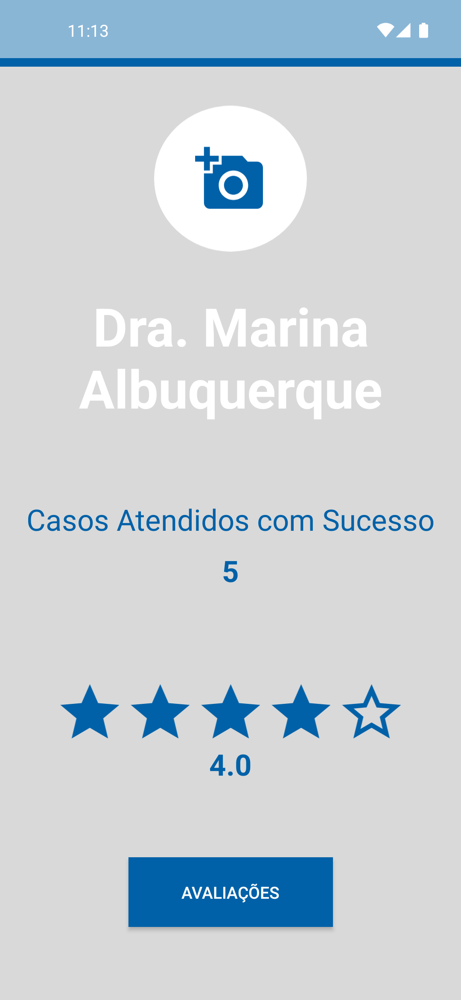 |

| Avaliações recebidas |
| :---: |
| 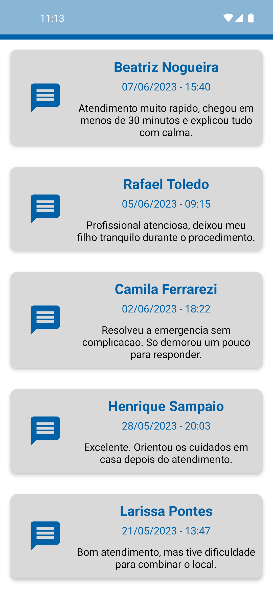 |

### Socorrista

| Início | Solicitar socorro | Socorro aberto |
| :---: | :---: | :---: |
| 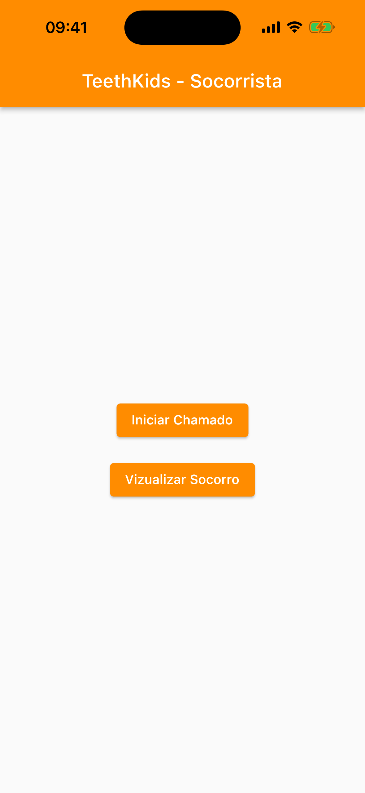 | 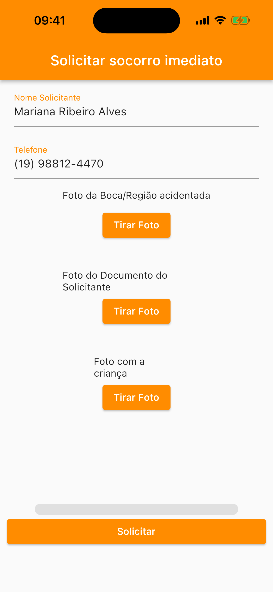 | 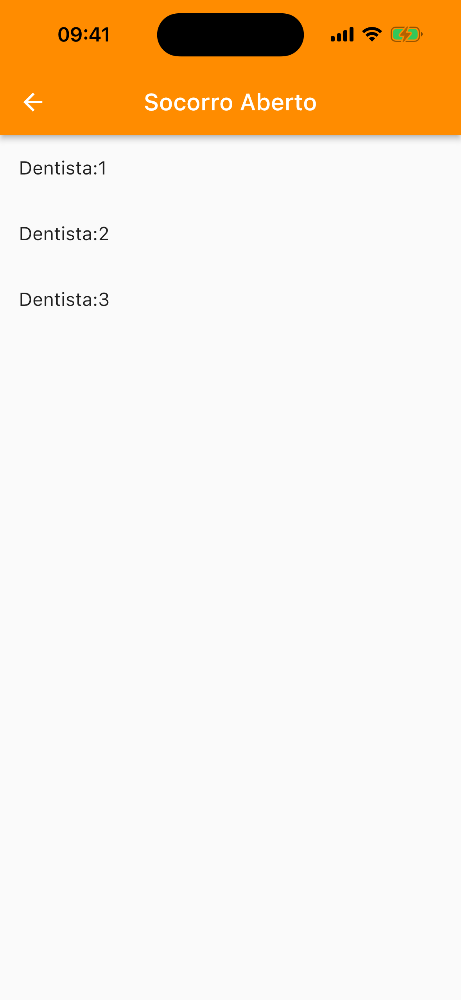 |

| Atendimento em andamento | Avaliação |
| :---: | :---: |
| 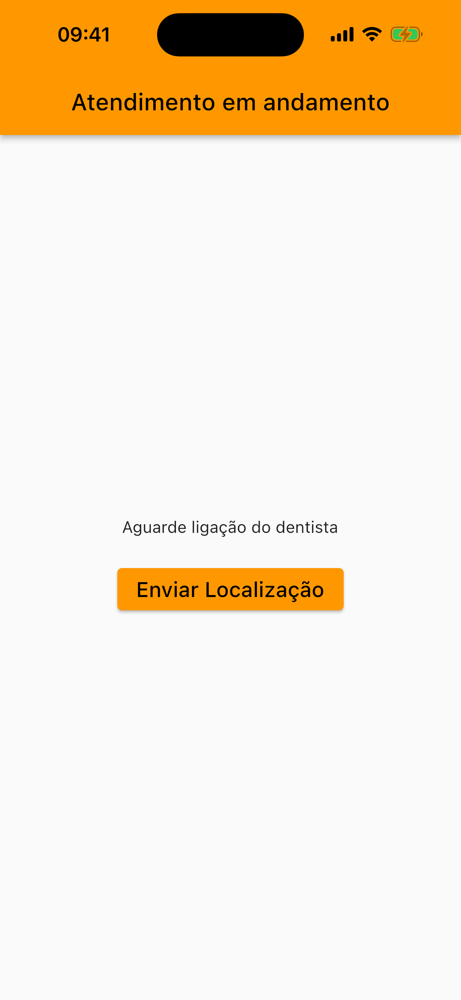 | 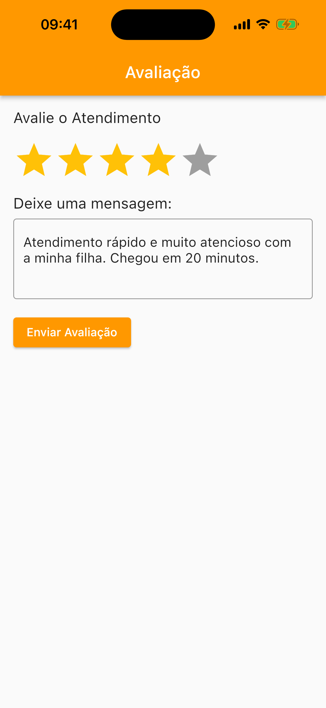 |

As telas de câmera (`TakePictureScreen`) e de mapa dependem de recursos que o simulador não renderiza e ficaram de fora. O código do aplicativo está em `Socorrista/` e as telas implementadas estão listadas em [Arquitetura](#️-arquitetura).

---

## 📌 Contexto e Motivação

TeethKids foi um trabalho da disciplina de **Programação para Dispositivos Móveis**, desenvolvido entre abril e junho de 2023. O tema — atendimento odontológico emergencial para crianças — veio pronto no enunciado da disciplina; o produto em si não era o objeto do trabalho.

O que estava em jogo era o domínio técnico da plataforma. O enunciado pedia **dois aplicativos distintos conversando pelo mesmo backend**, e é aí que estava o aprendizado: modelar um fluxo em que uma ação em um app precisa chegar ao outro, em outro dispositivo, sem que os dois se conheçam diretamente. Isso obrigou a lidar com Firestore como fonte de verdade compartilhada, Cloud Messaging para notificar o lado oposto e Cloud Functions para concentrar as regras que nenhum dos clientes deveria executar sozinho.

Do lado Android, o foco foi a estrutura de um app nativo em Kotlin: uma única Activity com o Navigation Component, navegação entre Fragments, ViewBinding, RecyclerView com adapters próprios e integração com CameraX e Google Maps.

Registro aqui o que o repositório realmente é, incluindo as decisões de organização que não envelheceram bem — a estrutura de pastas do Socorrista, descrita adiante, é uma delas.

---

## 🏗️ Arquitetura

Os dois aplicativos são clientes independentes do mesmo projeto Firebase. Nenhum deles chama o outro: a comunicação acontece através do Firestore e das Cloud Functions, que disparam notificações via FCM para o app do outro lado.

```
   ┌──────────────────────────┐         ┌──────────────────────────┐
   │        Socorrista        │         │         Dentista         │
   │      Flutter / Dart      │         │     Android / Kotlin     │
   │                          │         │                          │
   │  · abre o chamado        │         │  · lista as emergências  │
   │  · envia fotos da lesão  │         │  · aceita ou recusa      │
   │  · acompanha e avalia    │         │  · envia sua localização │
   └────────────┬─────────────┘         └────────────┬─────────────┘
                │                                    │
                └────────────────┬───────────────────┘
                                 │
              ┌──────────────────▼───────────────────┐
              │               Firebase               │
              │  Auth · Firestore · Storage · FCM    │
              ├──────────────────────────────────────┤
              │      Cloud Functions (TypeScript)    │
              │      região southamerica-east1       │
              │                                      │
              │  emergencyListener · setActions      │
              │  sendMessage · sendMessageToDentist  │
              │  sendRTS · sendRating · sendLocation │
              │  setUser · setToken · setAddress     │
              └──────────────────────────────────────┘
```

**Fluxo principal.** O socorrista abre um chamado com fotos e dados do acidente, que vão para o Storage e para a coleção `emergencies`. Uma Cloud Function observa essa coleção e notifica por FCM os dentistas disponíveis. No app Dentista o chamado aparece na lista de emergências; ao aceitar, a ação é registrada pela função `setActions` e o socorrista é avisado. Durante o atendimento o dentista compartilha a localização, e ao concluir o chamado uma notificação abre a tela de avaliação no app do socorrista. As notas alimentam a reputação exibida no perfil do dentista.

**Dentista** — projeto Gradle nativo, Activity única (`SignInActivity`) hospedando um `NavHostFragment`. As telas são Fragments coordenados por um único `nav_graph.xml`:

- Acesso: `SignInFragment`, `SignUpFragment`, `ResumeFragment`
- Emergências: `EmergenciesListFragment`, `EmergencyDetailFragment`, `EmergencyInProgressFragment`
- Perfil e reputação: `ProfileFragment`, `EditProfileFragment`, `ReputationProfileFragment`, `FeedbacksListFragment`
- Endereços: `AddressesListSignUpFragment`, `AddressesListProfileFragment`, `AddressRegisterSignUpFragment`, `AddressRegisterProfileFragment`, `EditAddressSignUpFragment`, `EditAddressProfileFragment`
- Recursos do dispositivo: `MapsFragment`, `CameraPreviewFragment`

O domínio fica em `model/` (`Emergency`, `Address`, `Action`, `Dentist`, `Feedback`), com `AddressesDao` para os endereços, `ImageHelper` para o tratamento das fotos e `DefaultMessageService` estendendo `FirebaseMessagingService` para receber as notificações.

**Socorrista** — aplicativo Flutter. A interface está concentrada em `lib/main.dart`, com as telas `PermissionScreen`, `AbrirChamado`, `Identificacao`, `MyCustomForm`, `TakePictureScreen`, `EmergenciesList`, `DetalhesScreen` e `Avaliacao`.

**functions/** — configuração do projeto Firebase (`firebase.json`, `firestore.rules`, `firestore.indexes.json`, `storage.rules`) e as Cloud Functions em TypeScript, todas registradas na região `southamerica-east1`.

---

## 🧰 Stack de Tecnologias

### Dentista (Android nativo)

| Tecnologia | Versão |
| --- | --- |
| Kotlin | 1.8.0 |
| Android Gradle Plugin | 7.4.2 |
| Gradle | 7.5 |
| compileSdk / targetSdk | 33 |
| minSdk | 29 |
| Firebase BoM | 32.0.0 |
| google-services | 4.3.15 |
| Navigation (fragment / ui-ktx / safe-args) | 2.5.3 |
| Material Components | 1.8.0 |
| AppCompat | 1.6.1 |
| ConstraintLayout | 2.1.4 |
| CameraX (camera2 / lifecycle / view) | 1.2.3 |
| Glide | 4.12.0 |
| FirebaseUI Storage | 8.0.0 |
| play-services-maps | 17.0.0 |
| play-services-location | 18.0.0 |
| secrets-gradle-plugin | 2.0.0 |

Serviços Firebase usados pelo app: Authentication, Firestore, Storage, Cloud Messaging e Cloud Functions.

### Socorrista (Flutter)

| Tecnologia | Versão |
| --- | --- |
| Dart SDK | >=2.19.6 <3.0.0 |
| Android Gradle Plugin | 7.2.0 |
| Kotlin (host Android) | 1.7.10 |
| minSdk / targetSdk | 21 / 31 |
| firebase_core | ^2.13.1 |
| firebase_auth | ^4.6.2 |
| cloud_firestore | ^4.8.0 |
| firebase_storage | ^11.2.2 |
| firebase_messaging | ^14.6.2 |
| cloud_functions | ^4.3.3 |
| camera | ^0.10.5 |
| image_picker | ^0.8.3 |
| image_gallery_saver | ^1.7.1 |
| geolocator | ^9.0.2 |
| permission_handler | ^10.3.0 |
| flutter_rating_bar | ^4.0.1 |
| url_launcher | ^6.1.11 |
| path_provider | ^2.0.15 |

### Backend

| Tecnologia | Versão |
| --- | --- |
| Node.js (runtime das functions) | 16 |
| firebase-functions | ^4.2.0 |
| firebase-admin | ^11.5.0 |
| TypeScript | ^4.9.0 |
| Região | southamerica-east1 |

---

## ⚙️ Configuração do Ambiente

### Dentista

O Gradle 7.5 usado pelo projeto **exige o JDK 17**. JDKs mais recentes não são aceitos por essa versão do Gradle e a build falha antes de compilar.

- **JDK 17** (Temurin ou equivalente)
- **Android SDK** com `platform-tools`, `platforms;android-33` e `build-tools;33.0.2`
- Para rodar em emulador: `system-images;android-33;google_apis;arm64-v8a` (ou `x86_64`, conforme a máquina)

Crie o arquivo `Dentista/local.properties` — ele não é versionado:

```properties
sdk.dir=/caminho/para/o/Android/sdk
GOOGLE_MAPS_API_KEY=sua-chave-do-google-maps
```

A chave do Maps é lida pelo `secrets-gradle-plugin` e injetada no `AndroidManifest.xml`. Sem uma chave válida o app compila e roda normalmente, mas o `MapsFragment` não renderiza o mapa.

### Socorrista

- **Flutter SDK** compatível com Dart 2.19 (canal stable da linha 3.7–3.10)
- O mesmo Android SDK do item anterior

### Reconectando um Firebase próprio

Os arquivos `google-services.json` versionados apontam para o projeto Firebase original da disciplina, **que não responde mais**. Para colocar os aplicativos em funcionamento é preciso apontá-los para um projeto novo:

1. Crie um projeto no [console do Firebase](https://console.firebase.google.com/) e habilite Authentication (e-mail/senha), Firestore, Storage e Cloud Messaging.
2. Registre os dois aplicativos Android com os respectivos `applicationId` e substitua os arquivos `google-services.json` de cada projeto pelos novos.
3. Publique as regras e os índices a partir de `functions/`:
   ```bash
   cd functions
   firebase use --add           # selecione o projeto criado
   firebase deploy --only firestore,storage
   ```
4. Instale e publique as Cloud Functions:
   ```bash
   cd functions/functions
   npm install
   cd ..
   firebase deploy --only functions
   ```
5. As funções estão fixadas na região `southamerica-east1`, e os clientes também. Se você publicar em outra região, ajuste as chamadas `Firebase.functions("...")` no Dentista e `FirebaseFunctions.instanceFor(region: ...)` no Socorrista.

O uso de Cloud Functions exige o plano Blaze na conta do Firebase.

---

## ▶️ Executando o Projeto

> O projeto Firebase original está fora do ar. Sem executar os passos de "Reconectando um Firebase próprio", os aplicativos compilam, instalam e abrem, mas as telas que dependem de dados remotos ficam vazias.

### Dentista

```bash
git clone https://github.com/guiazevedo17/TeethKids.git
cd TeethKids/Dentista

# aponte o JDK 17 e o SDK do Android
export JAVA_HOME=/caminho/para/jdk-17
printf 'sdk.dir=/caminho/para/Android/sdk\nGOOGLE_MAPS_API_KEY=sua-chave\n' > local.properties

# compila o APK de debug
./gradlew assembleDebug

# instala no emulador ou dispositivo conectado
adb install -r app/build/outputs/apk/debug/app-debug.apk
```

### Socorrista

```bash
cd TeethKids/Socorrista/Socorrista/teethsocorrista/TeethSocorrista/TeethSocorrista/teethsocorrista

flutter pub get
flutter run          # ou: flutter build apk --debug
```

### Cloud Functions

```bash
cd TeethKids/functions/functions
npm install
npm run build        # compila o TypeScript
cd ..
firebase emulators:start --only functions,firestore
```

---

## 📁 Estrutura de Pastas

```
TeethKids/
├── Dentista/                          # app Android nativo (raiz do projeto Gradle)
│   ├── app/
│   │   └── src/main/
│   │       ├── java/com/kids/teeth/dentista/
│   │       │   ├── activity/          # SignInActivity
│   │       │   ├── dao/               # AddressesDao
│   │       │   ├── fragment/          # todas as telas + ImageHelper
│   │       │   ├── messaging/         # DefaultMessageService (FCM)
│   │       │   ├── model/             # Emergency, Address, Action, Dentist, Feedback
│   │       │   └── recyclerview/adapter/
│   │       ├── res/navigation/nav_graph.xml
│   │       └── AndroidManifest.xml
│   ├── build.gradle
│   └── gradle/wrapper/                # Gradle 7.5
│
├── Socorrista/                        # app Flutter
│   └── Socorrista/
│       ├── app/                       # árvore de fontes Android sem arquivos Gradle
│       └── teethsocorrista/
│           └── TeethSocorrista/
│               └── TeethSocorrista/
│                   └── teethsocorrista/   # ← raiz real do projeto Flutter
│                       ├── lib/
│                       │   ├── main.dart
│                       │   └── firebase_options.dart
│                       ├── android/
│                       ├── ios/
│                       └── pubspec.yaml
│
└── functions/                         # configuração e backend Firebase
    ├── firebase.json
    ├── firestore.rules
    ├── firestore.indexes.json
    ├── storage.rules
    └── functions/
        ├── src/index.ts               # todas as Cloud Functions
        ├── package.json
        └── tsconfig.json
```

Duas observações sobre o Socorrista, para quem for navegar o repositório:

- A raiz real do projeto Flutter está seis níveis abaixo de `Socorrista/`, no caminho `Socorrista/Socorrista/teethsocorrista/TeethSocorrista/TeethSocorrista/teethsocorrista/`. A repetição veio de commits que trouxeram o projeto junto com as pastas que o continham, e nunca foi corrigida durante a disciplina. É esse diretório que deve ser aberto no editor e usado nos comandos `flutter`.
- `Socorrista/Socorrista/app/` contém uma árvore de fontes Android (Kotlin e layouts) sem `build.gradle` nem manifesto. É um resquício de uma versão anterior do app e não faz parte de nenhuma build.

---

## 👥 Créditos

Trabalho em grupo da disciplina de Programação para Dispositivos Móveis, entre abril e junho de 2023, desenvolvido com:

- [@blemess](https://github.com/blemess)
- [@Jzanholo](https://github.com/Jzanholo)
- [@lanzaaaa](https://github.com/lanzaaaa)

---

## ⚖️ Direitos

Projeto acadêmico, publicado para fins de estudo e portfólio. Não possui vínculo com nenhum serviço odontológico real e não se destina a uso em produção.
